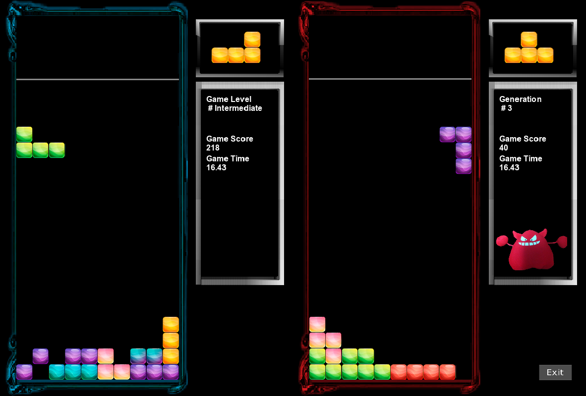

# Tetris AI 
Using Genetic Algorithm, AI was implemented.  
This project was written in GameMaker Studio 2.  
[TetrisWithAI.zip](TetrisWithAI.zip)  
[GameMaker Studio 2](https://accounts.yoyogames.com/downloads)

# Learning example

[TetrisPlay1](TetrisPlay1.mp4) [TetrisPlay2](TetrisPlay2.mp4)

# Weights
Weight consists of positive and negative factors that affect the game.  
For example, if you place a block and it has a lot of space between the blocks, it's not a good idea. We call this <b>Holes</b>.  
This means that you can count the number of spaces that occur when a block is placed in a position and use it as a weight.  
The weights selected in this way are : <b>MaxHeight, Bumpiness, Holes, CompleteLine</b>  

# ResultWeights.txt
File contains weights arranged in descending order for each generation.  
AI set random weights in the beginning, and AI play based on that.  
It store the weights in a file at the end of each generation. Of course you can call it up.  

Generation : 0 ~ 14 (AI is repeated 11 games for counting an average and the number of blocks is limited to 1000)  
Generation : 15 ~ (AI play only 1 game and there is no limit on the number of blocks)  
[ResultWeights.txt](ResultWeights.txt)

# Execution screen

