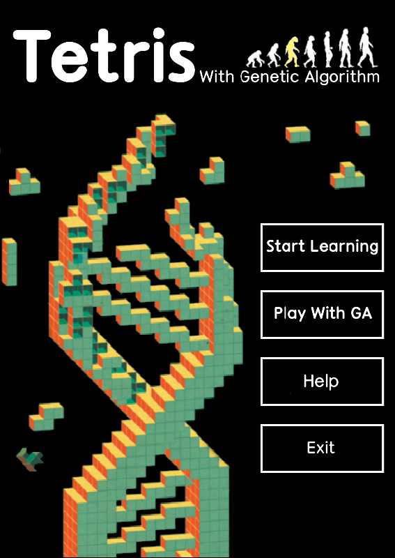
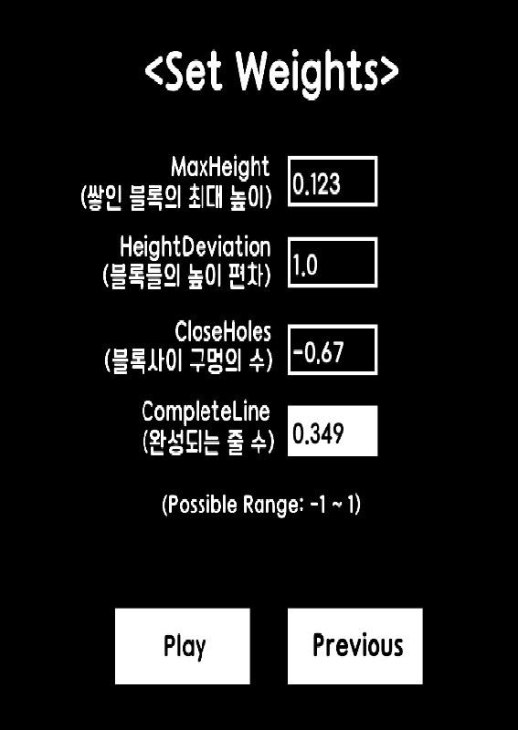
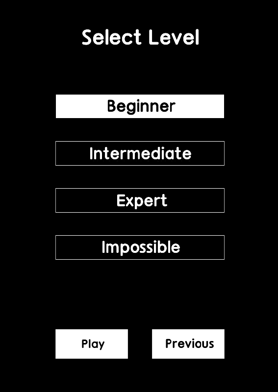

# Tetris AI 
Using Genetic Algorithm, AI was implemented.  
This project was written in GameMaker Studio 2.  

# Learning example

# Weights
Weight consists of positive and negative factors that affect the game.  
For example, if you place a block and it has a lot of space between the blocks, it's not a good idea. We call this <b>Holes</b>.  
This means that you can count the number of spaces that occur when a block is placed in a position and use it as a weight.  
The weights selected in this way are : <b>MaxHeight, Bumpiness, Holes, CompleteLine</b>

# Execution screen

